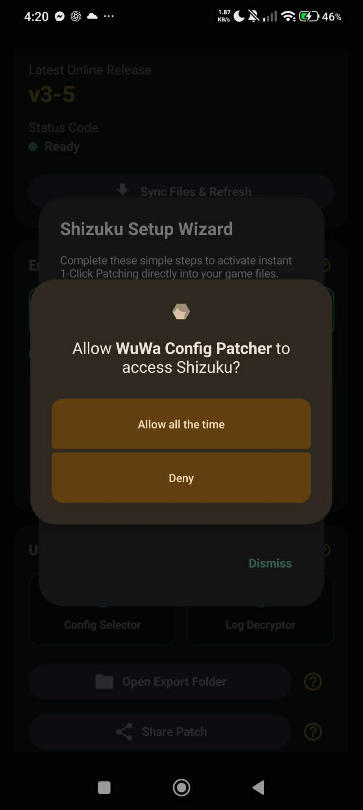
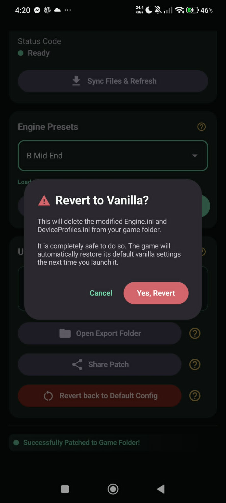
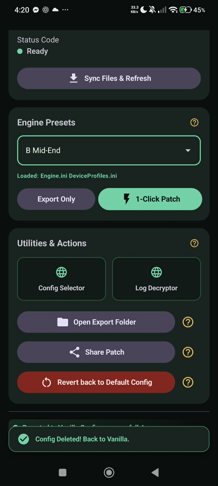

# WuWa Config Patcher

An ultra light-weight (3.2MB) android application to improve streamlining of the quality of life in applying mobile configuration for Wuthering Waves.

---

## Key Features

| Feature | Description |
|---|---|
| **1-Click Patching** | Uses the Shizuku service to write game configurations directly to the protected game data folder. No more wasting time navigating through Android's restricted data folders. |
| **Safe Revert** | Accidentally break your graphics settings? Use **Revert to Vanilla** to instantly restore default game files. |
| **[New] Advanced Multi-Select Patching** | Freely select specific combinations of `.ini` files to patch (e.g., just `Engine.ini` and `DeviceProfiles.ini`), or use the quick toggle to apply everything at once. |
| **Flexible Config Sources** | Easily load configuration files from any direct download URL (`.zip`), a local folder, or a local `.zip` file. |
| **Custom Repository Management** | Add, manage, and delete your own custom repositories with built-in setup guides. (The default Arglax repository is protected and always available). |
| **Repository Sync** | Instantly fetch the latest configs via pull-to-refresh, which also automatically verifies your Shizuku connection status. |
| **Expanded Utilities Toolkit** | Access a clean 2x2 grid to easily **Extract `Client.log`** for crash diagnosis, **Delete Logs** to clean up oversized files, and export/share your generated `.zip` patches with friends. |
| **Streamlined UI & Quality of Life** | Enjoy a less cluttered main screen with collapsible cards, detailed tooltips for all utilities, and a clearer preset selector that displays parent folder paths. |
| **Automatic Update Checker** | Get notified on startup when a newer version is available, with a one-tap link to update. |
| **Automatic Client.Log Extract and Decrypt** | When you extract your client.log, it also makes it readable. |
| **Custom Metadata Reader** | Showcase your ownership and config notes (For config creators/distributors) | 

## 🛠 Prerequisites
>[!IMPORTANT]
> ### Minimum
> - **Android 11 (API 30)** or higher
> - **Shizuku** installed and running (required for direct game folder access without root)
>  - Via wireless debugging (Android 11+) or a PC/ADB connection at least once for setup
> - **~50 MB free storage** for the app + your exported patch backups
> - **Wuthering Waves (Global)** installed
> - Internet connection (for syncing configs from the repository)
> ## Recommended
> - **Android 13+ (API 33)** or higher — smoother Shizuku wireless debugging pairing, matches modern devices better
> - **Shizuku running persistently** (auto-start on boot via wireless debugging, where supported)
> - **Stable Wi-Fi** for repository sync and patch downloads

This app requires **[Shizuku](https://shizuku.rikka.app/) / [Shizuku_GitHub](https://github.com/RikkaApps/Shizuku/releases/tag/v13.6.0)** to function. Shizuku bypasses Android's scoped storage restrictions and grants the app permission to modify your game files.

1. Install Shizuku from the Google Play Store or the official website.
2. Enable Shizuku via **Wireless Debugging**, **PC-Terminal** (non-rooted devices), or **Root access**.
3. Ensure the Shizuku daemon is active before opening the Patcher.

---

<strong>📖 Usage Guide</strong> (click to expand)

 

<strong>Installation</strong>

Since this app isn't from the Play Store, Android will flag it as unrecognized. This is expected.

1. Tap **Install anyway** when prompted.

   

2. Play Protect will scan and confirm the app is clean and safe to use.

   

3. On first launch, the Setup Wizard will prompt you to grant Shizuku permissions — tap **Allow all the time**.

   

<strong>Applying a Patch</strong>

**If Shizuku is already running:**
1. Open WuWa Config Patcher.
2. Tap **Sync Files & Refresh** (or pull down to refresh) to fetch the latest configs.
3. Select your preferred graphics preset from **Engine Presets**.
4. Tap **1-Click Patch** — you'll get a confirmation once it's applied.

   

**If Shizuku isn't set up yet:**
1. Open the app and trigger the **Setup Wizard** from the main screen.
2. Follow the prompts to install and authorize Shizuku.
3. Once Shizuku shows as **Running** and permission is granted, **1-Click Patch** unlocks automatically.

**To undo a patch:**
Tap **Revert back to Default Config**, confirm the prompt, and you're back to stock settings. The game recreates its default files automatically on next launch.

 

Selecting an Online Repository (Custom URL)

 

Switch the repository source to **Custom Online Repository** and paste in a direct **.zip download link**.

> 💡 To get the link: find the config's download button on its host page, then **right-click (or long-press) → Copy Link Address**. Paste that URL into the app and tap **Sync Files & Refresh**.

Selecting a Local Repository

 

Switch the repository source to **Local Repository** and select a folder containing your `.ini` files.

> ⚠️ Android's scoped storage rules mean you must pick a **specific sub-folder** (e.g. a Downloads folder or a dedicated configs folder) — selecting the root of Internal Storage will be rejected by the system picker.

---

## Help & Troubleshooting

| Feature | Description |
|---|---|
| **Sync Files** | Downloads the latest config release, or pulls files from a custom URL / local repository. |
| **1-Click Patch** | Applies the patch directly to your config folder. Selecting Advanced will apply ALL `.ini` files found. |
| **Config Selector** | Opens a web browser to a tool for checking recommended config preset. |
| **Log Decryptor** | Decrypts your uploaded Client.log + some QoL features. |
| **Revert to Vanilla** | Deletes modified files. The game will automatically recreate default files on your next launch. |
| **(Advanced) Revert to Vanilla** | Deletes `DeviceProfiles.ini`, `Engine.ini`, `Scalability.ini`, and `GameUserSettings.ini`. |

---

## Disclaimer
>[!IMPORTANT]
>This tool is for optimization purposes only. By using this app, you acknowledge that modifying game files is done at your own discretion. Always ensure you have a backup if you are unsure about the changes you are applying, especially if you have your own **customized** config — otherwise it will be lost. The application does not tamper with your data except to patch the config file, and all included tools run locally on your device. No data is transmitted to an external, online server.

---

## 💻 Technical Stack

- **Language:** Kotlin
- **UI Framework:** Jetpack Compose (Material 3)
- **Permissions:** Shizuku API
- **Architecture:** Repository-pattern driven, Coroutine-based concurrency
